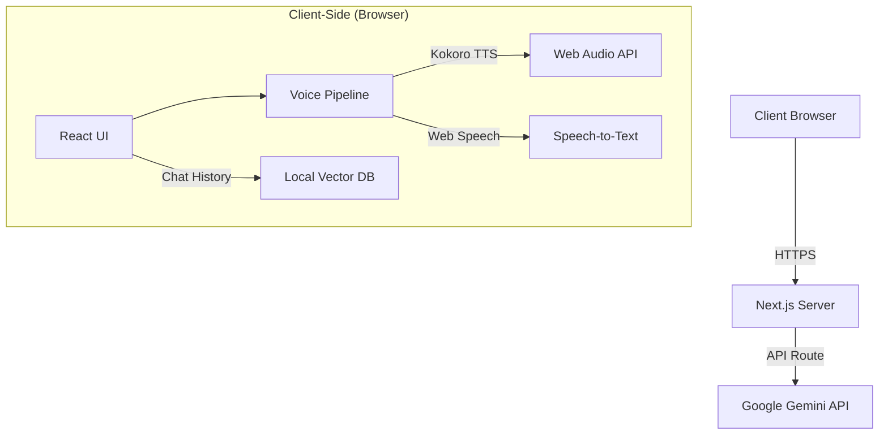

# System Architecture

Aether follows a "Feature-First" (Screaming Architecture) pattern, organizing code by domain rather than file type. This ensures scalability and maintainability.

## High-Level Overview

The application is a Single Page Application (SPA) built with Next.js (App Router), running primarily on the client-side to leverage Web APIs (Web Speech, Web Audio, WebGPU).

## Core Modules

### 1. Session Management (`features/session`)
Handles the lifecycle of a user session, including:
-   **Boot Sequence**: Loading models and initializing services.
-   **Access Control**: Rate limiting and access codes.
-   **Visual State**: Orchestrating the UI (`StatusDisplay`, `OrbContainer`).

### 2. Voice Pipeline (`features/voice`)
Manages audio input and output:
-   **`useVoiceAgent`**: The central coordinator for voice interactions.
-   **`useSpeechRecognition`**: Wraps the Web Speech API for STT.
-   **`useTTS`**: Manages Text-to-Speech generation using Kokoro (WebGPU) with fallback to Web Speech API.
-   **`AudioPlayer`**: Handles gapless audio playback queues.

### 3. AI Integration (`features/ai`)
-   **`chat-service`**: Communicates with the Vercel AI SDK and Google Gemini.
-   **`system-prompt`**: Dynamic prompt engineering based on context and memory.

### 4. Local Memory (`features/memory`)
-   **`memory-service`**: Stores and retrieves conversation embeddings using a local vector database (client-side RAG) backed by IndexedDB.

## Data Flow

1.  **Input**: User speaks -> `useSpeechRecognition` converts to text.
2.  **Processing**: Text -> `useConversation` -> `chat-service` (Gemini).
3.  **Memory**: `chat-service` retrieves relevant context from `memory-service`.
4.  **Output**: AI Response (Stream) -> `useMessageQueue` -> `useTTS` -> `AudioPlayer`.
5.  **Feedback**: UI updates in real-time via `StatusDisplay` and `OrbContainer`.
