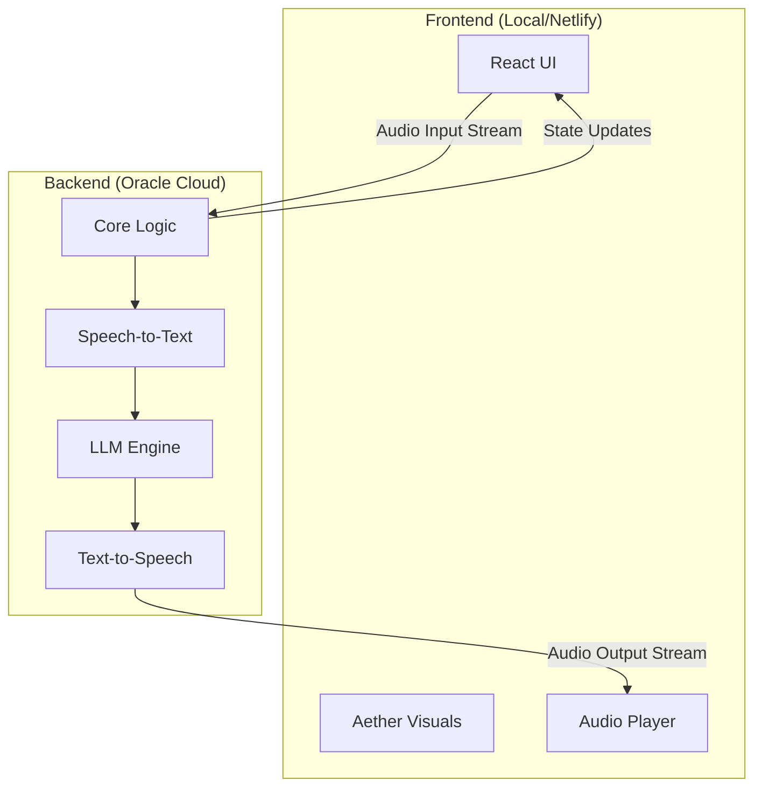

# System Architecture

Aether follows a distributed architecture with a strict separation between the frontend client (UI) and the backend services (Logic/Processing).

## High-Level Overview

1.  **Frontend (`aether-frontend`)**:
    *   **Role**: Strict User Interface, Visuals/Animation, Connection Management.
    *   **Tech**: Next.js (React), Web Audio API (Playback only).
    *   **Deployment**: Netlify (Edge/Static) or Vercel.
    *   **Structure**: Flat structure (`components`, `hooks`, `services`).

2.  **Backend (`aether-backend`)**:
    *   **Role**: Core Logic, Audio Processing (STT/TTS), AI/LLM Integration, Session State.
    *   **Location**: `http://159.54.180.60:3000`
    *   **Tech**: Node.js/Next.js API Server.

## Core Modules

### 1. Frontend Modules (`aether-frontend/src`)
*   **`components/`**: UI components grouped by domain (`session`, `visuals`, `modals`).
*   **`hooks/`**: React hooks for UI state (`use-session-manager`, `use-aether-visuals`).
*   **`services/`**: API clients and connection handlers.
*   **`utils/`**: Shared utilities (helpers, types).
*   **`context/`**: React Context providers (SessionContext).

## Data Flow (Planned)

1.  **Input**: User speaks -> Frontend streams audio to Backend.
2.  **Processing**: Backend processes audio (STT) -> Generates response (LLM) -> Synthesizes audio (TTS).
3.  **Output**: Backend streams audio and state updates (transcript, status) to Frontend.
4.  **Display**: Frontend renders visuals (Orbs) based on state updates and plays audio.

*Note: The Frontend has been refactored to remove heavy client-side logic (WebGPU, Local Memory, Web Speech API recognition) in favor of a backend-driven approach.*
